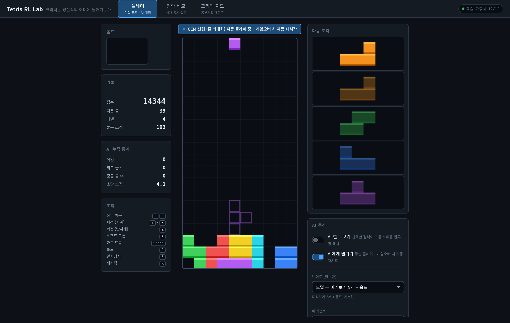
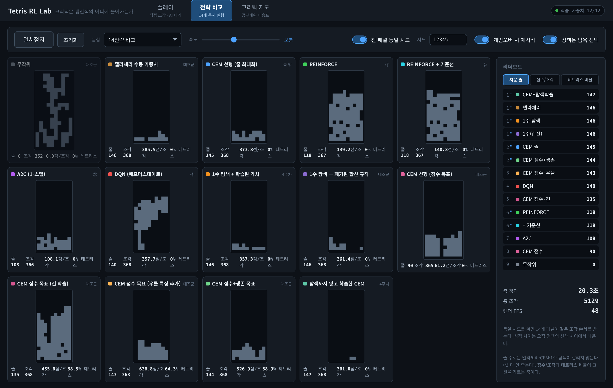
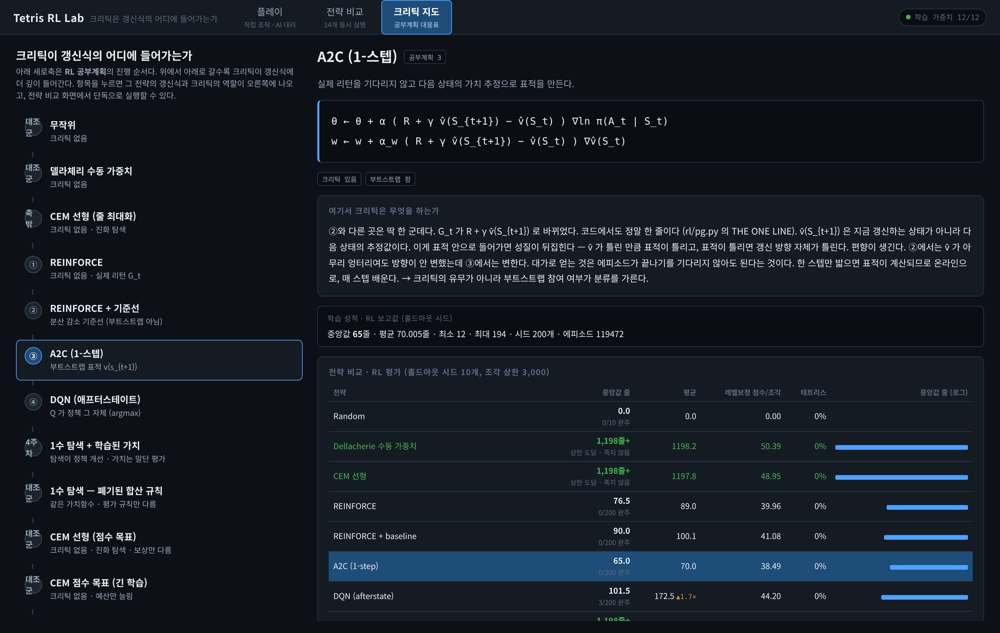

# tetris-rl-testbed

브라우저에서 도는 테트리스입니다. **직접 칠 수 있고, AI 14개가 같은 조각을 받아 동시에 두는 것을 나란히 볼 수 있습니다.**

### ▶ [지금 바로 열기](https://revinqbank.github.io/tetris-rl-testbed/)

---

## 화면 미리보기

| 화면 | 하는 일 | 요점 |
|---|---|---|
| [**직접 플레이**](#직접-플레이--play) | 키보드로 친다. AI에게 넘길 수도 있다 | 난이도가 **속도가 아니라 정보량** |
| [**전략 비교**](#전략-14개-동시-비교--arena) | AI 14개가 한 화면에서 동시에 둔다 | **전부 같은 조각 순서**를 받는다 |
| [**크리틱 지도**](#알고리즘별-학습-방식--learn) | 알고리즘마다 무엇을 어떻게 배우는지 | 갱신식에서 **크리틱이 들어가는 자리** |

### 직접 플레이 — PLAY



방향키로 옮기고 위쪽 키로 돌리고 스페이스로 떨어뜨립니다. 조각이 바닥에 닿아도 **0.5초 동안은 더 움직일 수 있어서**, 좁은 틈에 밀어 넣는 조작이 됩니다.

**AI에게 넘기기**를 켜면 학습된 정책이 대신 둡니다. 위 사진이 그 상태입니다. 게임오버가 나면 알아서 다시 시작하므로 계속 돕니다.

난이도는 속도가 아니라 **보여주는 정보의 양**으로 바뀝니다.

| | 다음 조각 미리보기 | 홀드 |
|---|---|---|
| 노멀 | 5개 | 있음 |
| 하드 | 1개 | 있음 |
| 익스트림 | **없음** | 없음 |

*(속도를 올리는 방식은 뺐습니다. 사람만 손이 못 따라갈 뿐, AI에게는 난이도가 전혀 안 오릅니다.)*

### 전략 14개 동시 비교 — ARENA



14개 판이 한 화면에서 같이 돕니다. **전부 똑같은 조각 순서를 받습니다.** 그래야 성적 차이가 운이 아니라 실력 차이가 됩니다.

**보고 있으면 성격이 눈에 띕니다.** 어떤 판은 **바닥을 평평하게 깎으며 끝없이 버티고**, 어떤 판은 **한쪽에 깊은 골을 파놓고 기다리다가 긴 막대가 오면 네 줄을 한 번에 지웁니다.** 둘은 같은 알고리즘이고, **점수를 무엇으로 셀지만 다르게 학습시켰습니다.**

사진에서도 갈립니다. `CEM 점수 목표 (우물 특징 추가)` 판은 테트리스 비율이 **64.3%** 인데 `CEM 선형 (줄 최대화)` 판은 **0%** 입니다. 같은 게임, 같은 조각, 다른 목표입니다.

### 알고리즘별 학습 방식 — LEARN



정책마다 무엇을 보고 어떻게 갱신하는지 적어놨습니다. REINFORCE, A2C, DQN이 서로 무엇이 다른지 나란히 놓고 볼 수 있습니다. 네 알고리즘은 갱신식에서 **한 자리만 다릅니다** — 그 자리에 실제 보상이 들어가는지, 추정한 가치가 들어가는지가 분류를 가릅니다.

---

## 이 저장소가 알아낸 것

여기부터는 실험 이야기입니다. **결론 한 줄은 이렇습니다.**

> **학습 알고리즘이 아니라, 판을 무엇으로 요약할지 정한 쪽이 AI를 똑똑하게 만들었습니다.**

### AI가 보는 판 — 숫자 10개로 요약한다

AI는 화면 그림을 보지 않습니다. 조각을 놓아본 다음의 판을 **숫자 10개로 요약**해서 넘깁니다. 구멍이 몇 개인지, 전체 높이가 얼마인지, 표면이 얼마나 울퉁불퉁한지, 가장 깊은 골이 얼마나 깊은지 같은 값입니다. 이 숫자를 **특징(feature)** 이라고 부릅니다.

AI가 하는 일은 이 숫자 10개에 **곱할 가중치를 정하는 것**뿐입니다. 놓을 자리 30군데를 다 놓아보고, 점수가 제일 높은 자리를 고릅니다.

### 여섯 방법의 성적

여섯 가지 방법을 같은 게임 위에서 돌렸습니다. **점수가 높을수록 잘합니다.**

| 점수 | 방법 |
|---:|---|
| **82.2** | 진화탐색(CEM) — 가중치를 무작위로 뿌려보고 잘된 것 주변을 다시 뿌리는 방식 |
| 74.2 | 같은 진화탐색 + 오래 살아남는 것도 목표에 넣음 |
| 50.4 | **사람이 손으로 정한 가중치 — 학습을 아예 안 함** |
| 44.2 | DQN |
| 41.1 | REINFORCE + baseline |
| 40.0 | REINFORCE |
| 38.5 | A2C |
| 0.0 | 무작위 |

**아래 넷이 교과서에 나오는 신경망 강화학습입니다. 그리고 학습을 한 번도 안 한 사람 손 가중치(50.4)가 그 넷을 전부 이깁니다.**

*(점수 = 조각 하나당 벌어들인 점수를 레벨 보정해 정규화한 값. 게임 길이에 좌우되지 않게 만든 지표입니다. 같은 시드 10판 평균.)*

### 이 순위가 나온 이유

**숫자 10개를 잘 골라놨기 때문입니다.** 그 10개가 판의 좋고 나쁨을 이미 거의 다 담고 있어서, 남은 일이 **곱할 수 10개를 찾는 것**뿐이었습니다. 신경망은 그 10개가 표현하는 것을 처음부터 다시 배워야 해서 훨씬 많은 경험이 필요했습니다.

```
진화탐색   약 23,000판을 보고  →  20,000줄 (안 죽음)
REINFORCE  140,064판을 보고    →  67줄
```

**6배 적게 보고 300배 잘합니다.**

### 실제로 효과가 있었던 변경

성적을 움직인 것이 무엇이었는지 하나씩 바꿔가며 확인했습니다.

| 무엇을 바꿨나 | 결과 |
|---|---|
| AI가 고르는 단위를 **키 입력 → 놓을 자리**로 | 이걸 안 하면 학습 자체가 안 됐다 |
| 목표를 **지운 줄 수 → 점수 → 점수 × 생존**으로 | 네 줄 한 번에 지우는 비율 0% → 59%, 생존 15배 |
| 특징을 **8개 → 10개**로 (골 깊이, 골 개수 추가) | 못 찾던 전략을 찾았다 |
| **한 수 앞을 더 보게 함** | **아무 차이 없었다** |

**마지막 줄이 요점입니다.** 문제를 어떻게 정의할지 바꾸면 전부 효과가 있었고, **알고리즘을 더 얹었을 때만 효과가 없었습니다.**

### 신경망을 얹어봤더니 더 나빠졌다

위 순위만 보면 *"신경망이라서 진 것 아니냐"* 고 의심할 수 있습니다. 그래서 **딱 하나만 바꾼 비교**를 따로 돌렸습니다. 특징 10개도, 목표도, 학습 방법도, 시간 예산도 전부 같게 두고 **정책의 모양만** 바꿨습니다.

| 점수 | 정책의 모양 |
|---:|---|
| **82.4** | 숫자 10개를 그냥 곱해서 더함 |
| 76.2 | 신경망 (은닉 4개) |
| 74.2 | 신경망 (은닉 8개) |

**표현할 수 있는 폭을 넓혔는데 성적이 내려갔습니다.**

신경망은 원래 단순한 곱셈-덧셈을 **포함합니다.** 은닉층에서 `relu(z) − relu(−z) = z` 가 되므로, 곱해서 더하는 것과 똑같이 행동하는 가중치가 신경망 안에 반드시 존재합니다. 실제로 그 가중치를 만들어 넣어 오차 4.44e-16으로 확인했습니다. **더 많이 표현할 수 있는데도 졌습니다.**

**그래서 문제는 표현력이 아니라 찾는 비용이었습니다.** 좋은 특징이 이미 있으면 찾을 것이 10개뿐인데, 신경망으로 바꾸면 찾을 것만 수백 개로 늘어납니다. **이게 앞의 순위표에서 신경망이 아래에 깔린 진짜 이유입니다.**

### 이 결과를 과신하면 안 되는 이유

**신경망 넷은 손이 덜 갔습니다.** 진화탐색만큼 조정하지 않았고, 학습할 때 **한 판을 300조각으로 잘라서** 긴 판을 경험할 기회 자체가 없었습니다. *"딥러닝이 원래 약하다"* 가 아니라 *"이 조건에서 이 예산으로는 졌다"* 입니다.

검증하지 못한 항목은 [docs/WALKTHROUGH.md](docs/WALKTHROUGH.md) §11에 따로 모아뒀습니다.

---

## 직접 돌려보기

```bash
git clone https://github.com/RevInqBank/tetris-rl-testbed
cd tetris-rl-testbed
bash tools/serve.sh                  # 웹 앱 (http://localhost:8080)
```

학습과 검증은 이렇게 합니다.

```bash
python3 engine/parity.py             # 게임 규칙이 구현마다 같은지 대조 (210 케이스)
bash tests/run_all.sh                # 테스트 15종
python3 rl/evaluate.py --cap 50000   # 위 순위표 재생성
python3 rl/cem.py --objective score_safe --features wells10 --minutes 55
```

학습에는 `numpy`가, 신경망 계열 재학습에는 `torch`가 필요합니다. 없으면 그 테스트는 **실패가 아니라 건너뜀**으로 표시됩니다. `TETRIS_PY` 로 인터프리터를 지정할 수 있습니다.

## 구조

| 폴더 | 무엇 |
|---|---|
| `engine/` | 게임 규칙의 정본(Python). 회전·킥·점수·락 딜레이 |
| `web/` | 브라우저 앱. `engine.js` 규칙, `policies.js` 정책, `arena.js` 다중 패널 |
| `rl/` | 학습·평가. `cem.py` 진화탐색, `pg.py` REINFORCE/A2C, `dqn.py`, `evaluate.py` |
| `weights/` | 학습된 가중치와 평가 결과 |
| `tests/` | 15종. 규칙·점수·구현 간 일치·UI를 실제 브라우저로 검사 |
| `logs/` | 실제 학습 로그 (세대별 성적 곡선) |

**게임 규칙 구현이 넷입니다** — Python 정본, 브라우저용 JS, 학습용 고속 시뮬레이터, 그리고 구형 비교용. 넷이 조금이라도 갈라지면 모든 숫자가 조용히 틀어지므로, 서로 대조하는 테스트로 묶어놨습니다.

## 문서

| | |
|---|---|
| [docs/WALKTHROUGH.md](docs/WALKTHROUGH.md) | **개발기.** 어디서 막혔고 그때 무엇을 물었는지. 처음 보는 사람 기준 |
| [docs/REPORT.md](docs/REPORT.md) | **실험 기록.** 실험마다 어떤 설정으로 돌렸고 왜 방향을 틀었는지 |
| [docs/TIMELINE.md](docs/TIMELINE.md) | 시간순 사건과 판정 이력 |
| [docs/spec.md](docs/spec.md) | 게임 규칙 명세. 네 구현이 공유하는 기준 |

**잘못 측정해서 없는 성과를 보고했던 일도 그대로 남겨놨습니다.** *"생존이 0/10에서 6/10으로 올랐다"* 고 보고했는데, **한 판의 길이 제한을 3,000조각으로 걸어둔 것이 하필 AI가 죽는 시점 한가운데**였습니다. 제한을 50,000으로 올리니 양쪽 다 0/10이었습니다. 원래 주장 옆에 정정이 같이 있습니다.

## 라이선스

MIT. `LICENSE` 참조.
