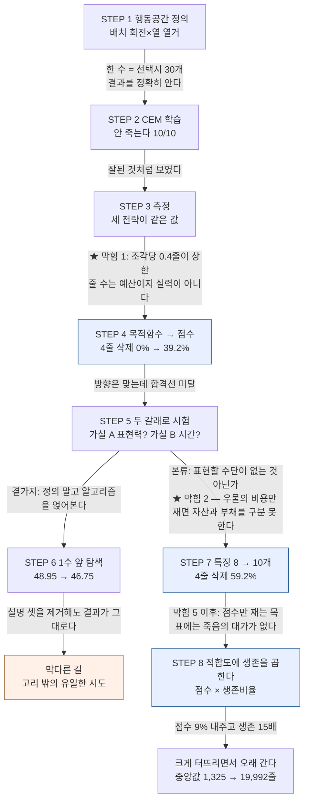

# 테트리스로 강화학습 실험대 만들기 — 개발기

테트리스 위에 강화학습 알고리즘 여섯 가지를 올려놓고 나란히 돌린 이야기다.
**어디서 막혔고, 그때 무엇을 물었고, 그 질문이 무엇을 바꿨는지**를 시간 순서대로 적었다.

**알아낸 것을 한 문장으로 적으면 이렇다.**

> **성능을 바꾼 것은 알고리즘이 아니라 문제 정의였다.**

바꾼 것과 그 결과를 나열하면 이렇다. **이 표의 각 행이 아래 절 하나씩에 대응한다.**

| # | 무엇을 바꿨나 | 결과 |
|---|---|---|
| 1 | **행동공간** — 프레임 단위 키 입력 → **배치**(회전 × 열) 열거 | **애초에 학습이 가능해졌다** |
| 2 | **목적함수** — 지운 줄 수 → 점수 → **점수 × 생존** | 정책 성격이 정반대로 (4줄 동시 삭제 비율 **0% → 39.2%**, 가중치 부호 반전). 마지막 형태는 **점수를 9% 내주고 생존을 15배로** 바꿨다 (§10). **목표가 세 번 바뀌었고 §5·§10 에 그 이력이 있다** |
| 3 | **특징** — 8개 → 10개 (우물 관련 2종 추가) | **못 찾던 전략을 찾았다** (4줄 동시 삭제 **39.2% → 59.2%**). 단 **생존은 개선 안 됨** |
| 4 | **지표** — 평균 → 중앙값, 상한 없는 축으로 | **비로소 차이가 보였다** (순위가 뒤집혔다) |
| 5 | **알고리즘을 하나 더 얹음** — 1수 앞 탐색 추가 | **이득 없음** — 그럴듯한 설명 셋을 제거하고도 |

**마지막 줄이 이 표의 요점이다.**
문제 정의를 바꾼 것은 **전부** 효과가 있었고, **알고리즘을 더한 것만 효과가 없었다.**

---

## 개발 흐름 한눈에

직선이 아니다. **"정의 → 학습 → 측정 → 막힘 → 정의를 다시 바꿈"** 이라는 고리가 **세 번** 돌았고,
**그 고리 밖으로 나간 시도(알고리즘 추가)만 아무것도 바꾸지 못했다.**

```
   ┌──────────────────────────────────────────────────────────────────┐
   │  STEP 1 — 행동공간을 정의한다                                    │
   │     프레임 단위 키 입력 → 배치(회전 × 열) 열거                   │
   └───────────────────────────┬──────────────────────────────────────┘
                               │ 한 수 = 선택지 30개 안팎.
                               │ 놓은 결과를 정확히 알 수 있다
                               ▼
   ┌──────────────────────────────────────────────────────────────────┐
   │  STEP 2 — CEM 으로 학습한다 (가중치 8개를 직접 탐색)             │
   │     결과: 안 죽는다. 10판 전부 상한까지                          │
   └───────────────────────────┬──────────────────────────────────────┘
                               │ 잘된 것처럼 보였다
                               ▼
   ┌──────────────────────────────────────────────────────────────────┐
   │  STEP 3 — 측정한다                                               │
   │     결과: 세 전략이 전부 같은 값. 구분이 안 된다                 │
   └───────────────────────────┬──────────────────────────────────────┘
                               │ ★ 막힘 1 — 조각당 0.4줄이 이론 상한이라
                               │ 줄 수는 '예산'이지 '실력'이 아니다  → 정의를 바꾼다
                               ▼
   ┌──────────────────────────────────────────────────────────────────┐
   │  STEP 4 — 목적함수를 바꾼다: 줄 수 → 점수                        │
   │     4줄 동시 삭제 0% → 39.2%    〈첫 번째 고리〉                 │
   └───────────────────────────┬──────────────────────────────────────┘
                               │ 방향은 맞는데 합격선 미달
                               ▼
   ┌──────────────────────────────────────────────────────────────────┐
   │  STEP 5 — 왜 안 되나: 두 갈래로 나눠 시험한다                    │
   │     가설 A 표현력 부족?    가설 B 학습 시간 부족?                │
   └──────────────────────────────────────────────────────────────────┘
      ├───────────────────────────────┴──────────────┐
      │ 곁가지 — 정의 말고                           │ 본류 — 표현할 수단이
      │ 알고리즘을 얹어본다                          │ 없는 것 아닌가
      ▼                                         ▼
   ┌───────────────────────────────┐  ┌───────────────────────────────┐
   │  STEP 6 — 1수 앞 탐색         │  │  STEP 7 — 특징 8 → 10개       │
   │     48.95 → 46.75 (더 낮다)   │  │     4줄 동시 삭제 59.2%       │
   └───────────────────────────────┘  └───────────────────────────────┘
      │ 설명 셋을 제거해도            │ 점수·4줄 비율은 올랐다
      │ 결과가 그대로다               │ 생존은 개선 안 됨
      ▼                               ▼
   ╔═══════════════════════════════╗  ╔═══════════════════════════════╗
   ║  막다른 길 — 고리 밖의        ║  ║  못 찾던 전략을 찾았다        ║
   ║  유일한 시도였다              ║  ║  〈두 번째 고리〉             ║
   ╚═══════════════════════════════╝  ╚═══════════════════════════════╝
                                                      │
                                                      │ ★ 막힘 5 이후 — 점수만 재는 목표에는
                                                      │ 죽음의 대가가 없다 → 정의를 또 바꾼다
                                                      ▼
                                     ┌───────────────────────────────┐
                                     │  STEP 8 — 적합도에 생존을     │
                                     │  곱한다: 점수 × 생존비율      │
                                     └───────────────┬───────────────┘
                                                     │ 점수 9% 내주고
                                                     │ 중앙값 1,325 → 19,992줄
                                                     ▼
                                     ╔═══════════════════════════════╗
                                     ║  크게 터뜨리면서 오래 간다    ║
                                     ║  〈세 번째 고리〉             ║
                                     ╚═══════════════════════════════╝
```

**STEP 4·7·8 이 같은 고리다** — 막히면 알고리즘이 아니라 **문제 정의로 돌아갔다.**
**STEP 6(탐색)만 그 고리 밖에 있고, 유일하게 성과가 없었다.**

<details>
<summary>같은 그림 (mermaid — 렌더되는 뷰어용)</summary>



</details>

---

## 1. 무엇을 만들었나

브라우저에서 여는 웹 앱 하나다. 화면이 셋이다.

| 화면 | 무엇을 하나 |
|---|---|
| **PLAY** | 사람이 키보드로 직접 친다. 옵션을 켜면 AI 가 무한히 대신 플레이한다 |
| **ARENA** | **14개 전략이 동시에** 각자 판을 돌린다. 어느 정책이 어떻게 쌓는지 눈으로 비교한다 |
| **LEARN** | 각 전략이 "크리틱을 어디에 쓰는가"를 지도처럼 보여준다 |

```bash
bash tools/serve.sh        # 기본 포트 8080 → http://localhost:8080/
```

**왜 14개인가.** 학습한 것 12종 + 학습 없는 대조군 2종(무작위, 사람이 손으로 정한 가중치)이다.
대조군이 있어야 "학습이 뭔가를 했는지"를 말할 수 있다.

### 왜 하필 테트리스였나

**게임을 만드는 것이 목적이 아니었다.** 만든 사람이 강화학습을 공부하면서
*"크리틱이 갱신식의 어디에 들어가는가"* 라는 축을 따라가고 있었다 — REINFORCE, 기준선, A2C, DQN 순이다.

**그 축은 알고리즘마다 다른 문제로 비교하면 아무 말도 못 한다.** REINFORCE를 카트폴에서,
A2C를 아타리에서 돌려놓고 둘을 비교할 수는 없다. **하나의 문제 위에 그 알고리즘들을 나란히 세우는
실험대**가 필요했고, 테트리스가 그 자리에 놓였다. 패널 배치가 그 축을 그대로 따른다.

---

## 2. 첫 결정이 성패를 갈랐다 — 행동공간

**가장 중요한 결정이 학습을 시작하기 전에 나왔다.**

### 프레임 단위로 갔으면 어떻게 됐을까

에이전트에게 사람과 같은 것을 주는 방법이 있다 — 매 프레임 `왼쪽 / 오른쪽 / 회전 / 소프트드롭 / 하드드롭` 중 하나.
자연스러워 보이지만 학습에는 최악이다.

- 조각 하나를 놓는 데 **수십 프레임**이 걸린다. 보상(줄 삭제)은 그 끝에만 온다
- 중간의 수십 번 선택 중 **무엇이 좋았는지 알 수 없다** — 이것이 크레딧 할당 문제다
- 같은 배치에 도달하는 키 입력 조합이 **여러 개**다. 학습이 그 중복을 전부 따로 배운다

### 그래서 배치를 열거했다

에이전트의 한 수를 **"조각을 어느 회전으로 몇 번째 열에 떨어뜨릴 것인가"** 하나로 정의했다.

```
legal_placements(state) → [(회전, 열), ...]   보통 30개 안팎
apply_placement(state, p) → (다음 상태, 부가정보)
```

**이 정의가 세 가지를 한꺼번에 해결한다.**

1. **한 수 = 한 결정.** 크레딧 할당 구간이 수십 프레임에서 1로 줄었다
2. **중복이 사라진다.** 같은 결과를 내는 키 조합들이 하나의 선택지로 합쳐진다
3. **선택지가 30개뿐**이라 전부 시험해보고 고를 수 있다

**한 수를 고르는 비용**은 이렇다 — 배치 30개를 각각 놓아보고, 각 판마다 특징 8개를 계산하고, 가중합을 비교한다.
**즉 판 평가 30회.** 이것이 뒤에서 "탐색은 25배 비싸다"(§7)를 말할 때의 기준선이다.

### afterstate — 놓은 뒤의 판을 본다

테트리스에는 유리한 성질이 하나 더 있다. **조각을 놓으면 결과가 정확히 정해진다** — 주사위도, 상대도 없다.

그래서 "이 수가 얼마나 좋은가"를 예측할 필요가 없다. **놓아보고 그 판을 평가하면 된다.**
이렇게 놓은 직후의 판 상태를 **afterstate** 라고 부른다.

정책은 이렇게 동작한다.

```
30개 선택지를 전부 놓아본다
  → 각 afterstate 를 숫자 8개로 요약한다 (아래 §3)
  → 점수가 가장 높은 것을 고른다
```

**사람 경로와 에이전트 경로는 같은 엔진의 다른 진입점이다.**
사람은 키를 누르고 에이전트는 배치를 고르지만, 판이 바뀌는 규칙은 하나다.
UI 는 에이전트가 고른 배치를 애니메이션으로 재생만 한다.

---

## 3. 첫 학습 — 신경망 대신 진화탐색(CEM)부터

### 왜 신경망이 아니었나

판을 숫자 8개로 요약하기로 했다. 이 8개를 **특징(feature)** 이라고 부른다.

| 특징 | 뜻 |
|---|---|
| `landing_height` | 방금 놓은 조각이 얼마나 높이 앉았나 |
| `eroded_piece_cells` | 그 조각이 줄 삭제에 몇 칸이나 기여했나 |
| `row_transitions` | 가로로 훑을 때 찬 칸↔빈 칸이 몇 번 바뀌나 (표면이 얼마나 너덜한가) |
| `column_transitions` | 세로로 훑을 때 같은 것 |
| `holes` | 위에 블록이 덮인 빈 칸 (메우기 어려운 구멍) |
| `cumulative_wells` | 우물(양옆이 막힌 열)의 깊이 비용 |
| `aggregate_height` | 전체 높이 합 |
| `bumpiness` | 이웃 열 높이차의 합 (울퉁불퉁함) |

**이 8개는 새로 만든 것이 아니다.** Dellacherie 라는 사람이 손으로 정한 유명한 테트리스 평가 지표다.

> ⚠️ **이 8개가 판을 충분히 요약한다는 보장은 없다.**
> 지금은 "사람이 쓰던 것이니 쓸 만하겠지"로 출발한 것이고, **그 가정이 §8 에서 깨진다.**

정책 점수는 이 8개의 **가중합**이다 — `점수 = w₁·f₁ + ... + w₈·f₈`.
즉 **학습할 것이 숫자 8개뿐**이다. 신경망을 꺼낼 이유가 없다.

### CEM — 좋은 후보 쪽으로 분포를 좁혀간다

**CEM**(Cross-Entropy Method)은 진화적 탐색이다. **크리틱도 경사도 없다.**

찾아야 할 것이 숫자 8개(가중치)뿐이므로, 그 8차원 공간에 **가우시안 분포 하나**를 놓고 그것을 좁혀간다.

```
분포 초기화: 평균 μ (8차원), 표준편차 σ (8차원)

매 세대:
  1. 그 분포에서 후보 가중치를 64벌 뽑는다              ← 탐색
  2. 각 후보로 게임을 8판 돌려 적합도 평균을 낸다        ← 평가
  3. 적합도 상위 15%(64벌 중 약 10벌, elite)만 남긴다
  4. elite 의 평균과 분산으로 μ, σ 를 다시 잡는다        ← 학습
  5. σ 가 하한 아래로 못 내려가게 막는다                 ← 아래 참조
  → 반복
```

*(실제 값이다 — `rl/cem.py` 의 `--candidates 64`, `--seeds 8`, `elite_frac 0.15`.)*

**2단계에 조건이 하나 붙는다.** 같은 세대의 후보 64벌은 **반드시 같은 시드 8개**로 평가한다.
서로 다른 게임에서 재면 **"가장 좋은 가중치"가 아니라 "가장 운 좋은 조각 순서"** 를 뽑게 된다.

**σ 가 하는 일이 핵심이다.** 처음에는 크게 잡아 넓게 흩뿌리고, elite 가 한곳에 모일수록 σ 가 줄어
**점점 좁은 영역만 뒤진다.** 즉 **탐색에서 수렴으로 스스로 넘어간다.**

### 5단계가 왜 필요한가 — 실제로 밟은 함정

**처음 구현에는 분산 하한이 없었다.** 그러면 4단계가 매 세대 분포를 좁히기만 하므로 **σ 가 0 으로 수렴한다.**
실제로 그렇게 됐고, 그 뒤로도 200세대 가까이 더 돌았다.

**σ 가 0 이면 1단계에서 뽑히는 후보 64벌이 전부 똑같은 가중치다.**
elite 선별에 고를 것이 없고 **학습이 원리적으로 불가능하다.**

**그런데 곡선의 적합도는 계속 움직였다.** 2단계에서 세대마다 시드를 새로 뽑기 때문이다 —
**고정된 정책 하나를 매 세대 다른 게임으로 재평가한 것**이고, **그 변동이 학습처럼 보였다.**
심지어 그 실행의 최고 기록이 붕괴 이후 구간에서 나왔다.

지금은 `σ = max(σ, 0.02)` 로 막고, 붕괴하면 화면에 명시하며 **몇 세대가 실제로 탐색했는지**를 파일에 남긴다.

> **이 함정의 교훈**: σ 값은 처음부터 곡선 파일에 기록되고 있었다.
> **값이 있었는데 아무도 그 열을 읽지 않았다.** (§9 막힘 4)

### 왜 경사를 안 쓰는 것이 여기서 이득인가

**목적함수를 미분할 수 없어도 된다.**

경사 기반 학습은 "목표를 파라미터로 미분한 값"이 필요하다. 그런데 이 프로젝트가 재고 싶은 것은
**지운 줄 수**, 나중에는 **4줄 동시 삭제 비율**이다. 둘 다 **미분 불가능하다** — 게임을 끝까지 돌려야 나오는 정수다.

CEM 은 **"돌려보고 순위를 매긴다"** 만 하므로 그런 목표를 **그대로 적합도로 쓸 수 있다.**
이 성질이 §5 에서 목적함수를 점수로 갈아끼울 때 그대로 값을 했다 — **적합도 함수 한 줄만 바꾸면 됐다.**

### 왜 CEM 을 신경망보다 먼저, 그리고 많이 썼나

| 이유 | |
|---|---|
| **찾을 것이 8~10개뿐** | 선형 가중치라 파라미터가 두 자릿수다. 신경망 수천 개를 경사로 미는 것보다 **직접 뒤지는 게 빠르다** |
| **목적함수를 자유롭게 바꿀 수 있다** | 위 이유. 줄 수 → 점수 → 4줄 비율로 갈아끼우는 것이 이 프로젝트의 축이었다 |
| **대조군이 필요했다** | **크리틱 없이 얼마나 갈 수 있는지**를 먼저 알아야, 크리틱을 넣었을 때의 이득을 말할 수 있다 |

실제로 이 문제에서 **선형 정책이 강했다.** 그래서 CEM 이 대조군에 그치지 않고
**끝까지 최고 성적을 낸 계열**이 됐다(§7 의 탐색 비교, §8 의 특징 실험 전부 CEM 위에서 돌았다).

### 왜 CEM 이 크리틱 기반 넷을 이겼나

| | 크리틱 4종 (①②③④) | CEM |
|---|---:|---:|
| 중앙값 줄 수 | 65~102 | **1,198** (안 죽어서 상한) |

**20~30배 차이다.** 정직하게 읽으면 이렇다.

> **정책이 숫자 8~10개뿐이고 게임 한 판이 밀리초면, 크레딧 할당 기계장치는 값을 못 한다.**
> 8차원 공간은 무작위로 뽑아 훑기에 **작고**, 롤아웃은 **싸다.**
> 그러면 "어느 수가 좋았는지"를 힘들게 추론할 이유가 없다 —
> **가중치를 통째로 바꿔서 결과를 직접 세어 보는 게 빠르다.**

**크리틱은 정책이 크고 표본이 비쌀 때 값을 한다. 여기는 둘 다 아니다.**

**한 문장으로**: CEM 은 크레딧 할당을 **포기하는 대신 결과를 직접 세어 본다.**
정책이 작고 게임이 싸면 그 교환이 남는 장사다.

> **이 강점에는 조건이 있다 — 찾을 것이 작을 때만이다.**
> **그 조건이 깨지는 것을 나중에 보게 된다.**(§6)

### 결과 — 안 죽는다

학습에 쓰지 않은 새 시드 10판에서 **한 판도 안 죽었다.** 목표(1,000줄)를 20배 넘겼다.

성공처럼 보였다. **그런데 이것이 다음 문제가 됐다.**

---

## 4. 지표가 죽었다

### 상한에 붙어버렸다

### "끝까지 갔다"는 무슨 뜻인가 — 이 문서의 모든 생존 수치가 여기 걸려 있다

**"안 죽었다"는 "영원히 안 죽는다"가 아니라 "내가 건 평가 예산까지 안 죽었다"이다.**

평가마다 **조각 상한**을 둔다(예: 3,000개 ≈ 1,200줄).
상한까지 놓으면 **`상한 도달`** 로 세고, 그 전에 죽으면 그 조각 수를 기록한다.

**왜 무제한으로 안 하나 — 원리적으로 끝나지 않기 때문이다.**
줄 최대화 정책은 **조각 20만 개(약 8만 줄)까지도 안 죽어서 평가가 종료되지 않는다.**
그래서 정직한 형태는 "무제한"이 아니라 **"충분히 큰 상한 + 그 상한을 함께 적기"** 다.

> **이 문서의 생존 수치는 전부 "몇 조각까지"와 함께 읽어야 한다.**
> "6/10 생존"은 그 자체로는 반쪽 문장이고, **"조각 3,000개까지 6/10 생존"** 이라야 완결된다.

#### 이게 왜 말장난이 아닌가 — 상한을 바꾸면 결론이 뒤집힌다

같은 두 정책을 상한만 바꿔가며 재면 이렇게 나온다. **10판 중 상한까지 살아남은 판의 수**다.

| 조각 상한 | 1,000 | 2,000 | **3,000** | 5,000 | 10,000 | 50,000 |
|---|---:|---:|---:|---:|---:|---:|
| 점수 목표, 특징 8개 | 10/10 | 10/10 | **5/10** | 1/10 | 1/10 | **0/10** |
| 점수 목표, 특징 10개 | 8/10 | 6/10 | **6/10** | 2/10 | 0/10 | **0/10** |
| *(대조)* 줄 수 목표 CEM | 10/10 | 10/10 | 10/10 | 10/10 | 10/10 | **10/10** |

**상한 3,000 에서는 "6/10 생존"이고, 50,000 에서는 "0/10 생존"이다. 같은 정책이다.**

**맨 아래 줄이 대조군이다.** 줄 수로 학습한 CEM 은 **50,000 에서도 10/10** 이고,
조각 20만 개(약 8만 줄)까지도 안 죽는다. **이쪽은 상한을 올려도 결론이 안 바뀐다.**
즉 **"안 죽는다"가 진짜인 정책과 상한이 만들어준 정책을 이 표가 갈라준다.**

**하필 3,000 이 최악의 자리였다** — 두 정책의 사망 조각 수 중앙값이 **3,165 와 3,354** 다.
**상한이 사망 분포의 한가운데 놓여 있어서 생존이 동전 던지기처럼 보였다.**

> **"충분히 큰 상한"의 기준은 측정 대상의 사망 분포보다 충분히 위여야 한다.**
> 상한 3,000 은 그 기준을 만족하지 못했다.

**이 표를 지우지 않고 둘 다 남긴 이유가 있다** — **두 상한의 결과를 나란히 두는 것 자체가 결과**이기 때문이다.
어느 한쪽만 적으면 "그 상한에서 그랬다"는 사실이 사라진다.

세 전략의 성적이 이렇게 나왔다.

| 전략 | 지운 줄 |
|---|---|
| 사람 손 가중치 (Dellacherie) | 1,998.3 |
| CEM 선형 | 1,997.5 |
| 1수 앞 탐색 | 1,998.2 |

**셋 다 10판 전부 상한 도달, 무사망이다.**

### 숫자가 실력이 아니라 예산이었다

조각 하나는 4칸이고 한 줄은 10칸이다. 그래서 **조각당 0.4줄이 이론 상한**이다.

| 조각 상한 | 나오는 줄 수 |
|---|---|
| 5,000 | 1,998 |
| 20,000 | 7,998 |
| 200,000 | 79,998 |

**준 만큼 나오는 숫자다.** 1,998.3 과 1,997.5 의 차이는 실력 차가 아니라 **시드별 반올림 잡음**이다.

> **안 죽는 정책들 사이에서 "지운 줄 수"는 아무것도 구분하지 못한다.**
> 이 지표로는 실험대가 성립하지 않는다.

### 부수적으로 배운 것 — 평균 대신 중앙값

죽는 정책 쪽에서는 다른 문제가 나왔다. 성적 분포가 **한쪽으로 길게 늘어져 있었다**(heavy-tail).
운 좋은 한 판이 평균을 통째로 끌어올린다 — 표본이 10개일 때는 **최대 게임 하나가 전체의 53~58%** 를 차지했다.

그래서 **중앙값**으로 바꾸고 표본을 200개로 늘렸다. 그러자 최대 게임의 비중이 **1~2%** 로 떨어졌다.
**두 조치가 각각 다른 문제를 풀었다** — 중앙값은 치우침을, 표본 확대는 한 판의 지배력을 없앴다.

---

## 5. 목적함수를 바꾸다 — 줄 수에서 점수로

### 목표는 세 번 바뀌었다 — 이 이력이 이 프로젝트의 줄거리다

| # | 목표 | 왜 바꿨나 | 결과 |
|---|---|---|---|
| 1 | **줄을 많이 지운다** | 처음 세운 것 | 안 죽는다. 그런데 **세 전략이 전부 같은 값** — 조각당 0.4줄이 이론 상한이라 다 천장에 붙었다 |
| 2 | **점수를 높인다** (4줄 동시 삭제 우대) | **지표가 실력을 구분 못 해서** | 4줄 삭제 0% → 59.2%. **그런데 자주 죽는다** |
| 3 | **점수를 높이되 죽지 않는다** | **점수만 재니 일찍 죽어도 고득점이면 좋은 정책으로 뽑혀서** | 진행 중 (§10) |

**★ 이 표가 이 문서 서두의 논지를 가장 잘 보여준다.**
**세 번 다 알고리즘은 그대로 두고 목표만 바꿨고, 세 번 다 정책의 성격이 바뀌었다.**

아래 §5 부터가 그 표의 전개다 — 2번을 이 절에서, 3번을 §10 에서 다룬다.

### 왜 점수인가

테트리스 점수는 **한 번에 몇 줄을 지웠는지**에 따라 크게 다르다.

| 삭제 | 점수 |
|---|---|
| 1줄 | 100 |
| 2줄 | 300 |
| 3줄 | 500 |
| **4줄 (tetris)** | **800** |

4줄을 한 번에 지우면 1줄씩 네 번(400점)의 **두 배**다.
그러려면 **한 열을 비워둔 채 나머지를 높이 쌓고 I 조각을 기다려야 한다.** 기다리는 동안 죽을 위험을 감수해야 한다.

**즉 점수는 "얼마나 오래 버티나"가 아니라 "얼마나 잘 쌓나"를 묻는다.** 안 죽는 정책들도 이 축에서는 갈린다.

### 함정 하나를 밟았다

첫 시도에서 적합도를 **조각당 점수**로 잡았다. 그런데 테트리스에는 `level` 배수가 있다 —
줄을 지울수록 레벨이 오르고, **모든 삭제 점수에 곱해진다.**

그래서 **레벨 60의 1줄 삭제(6,000점)가 레벨 1의 4줄 삭제(800점)를 압도했다.**
새 적합도가 사실상 **"얼마나 오래 살았나"를 다시 재고 있었다.**

결과가 그것을 그대로 보여줬다 — **조각당 1,546점인데 4줄 삭제 비율 0.1%.** 오래 살며 1줄씩 긁는 정책이었다.

**`level` 로 나눠서** 1줄 100 / 4줄 800 의 비율이 살아 있게 고쳤다.

> **포화된 지표를 버릴 때, 새 지표가 옛 지표를 다시 재고 있지 않은지 확인해야 한다.**

### 정책의 성격이 뒤집혔다

목적함수만 바꾸고 나머지는 전부 같게 두었다 — 같은 알고리즘, 같은 특징 8종, 같은 학습 코드.
**학습된 가중치의 부호가 뒤집혔다.**

| 특징 | 줄 수 목표 | 점수 목표 | |
|---|---:|---:|---|
| `cumulative_wells` (우물 비용) | −0.181 | −0.059 | 페널티가 1/3 로 |
| **`bumpiness`** (울퉁불퉁함) | **−0.139** | **+0.217** | **부호 반전** |
| `aggregate_height` (전체 높이) | −0.074 | **+0.050** | **부호 반전** (55분 학습판) |

**울퉁불퉁함과 높이를 벌하던 정책이 보상하는 정책이 됐다.**
4줄을 지우려면 한 열을 비워두고 높이 쌓아야 하는데, **그 상태가 정확히 "울퉁불퉁하고 높은" 판**이다.

**아무도 "우물을 파라"고 가르치지 않았다.** 적합도 함수만 바꿨는데 탐색이 그 전략을 찾아냈다.

### 대가도 같이 나왔다

*(4줄 삭제 비율은 **10판의 중앙값**이다. 평균으로 보면 38.9% 이고, 아래 §8 의 비교표가 평균 쪽을 쓴다.)*

| | 4줄 삭제 비율 (중앙값) | 점수/조각 | 지운 줄 (중앙값) |
|---|---:|---:|---:|
| 15분 학습 | 12.5% | 58.55 | **1,099** |
| 55분 학습 | **39.2%** | **62.88** | 207 |

**4줄 비율이 세 배가 되는 동안 지운 줄은 5분의 1이 됐다.**
**자주 터뜨리는 대신 자주 죽는 것을 정책이 선택한 것**이고, 그것이 "팍 터뜨리기"의 대가다.

---

## 6. 크리틱을 얼마나 깊이 넣을 것인가 — 네 알고리즘을 같은 문제에

### 왜 이 넷인가

사용자의 공부 계획이 **"크리틱이 갱신식의 어디에 들어가는가"** 라는 축을 따라간다.
*(크리틱 = 상태의 가치를 추정해 정책 학습을 돕는 별도 신경망.)*

| 패널 | 전략 | 크리틱의 역할 |
|---|---|---|
| ① | REINFORCE | **없음.** 한 판을 끝까지 두고 실제로 받은 보상을 쓴다 |
| ② | REINFORCE + 기준선 | **분산만 줄인다.** 보상에서 평균치를 빼되 편향은 안 넣는다 |
| ③ | A2C (1-step) | **부트스트랩 표적.** `실제 보상` 대신 `보상 + 다음 상태의 추정 가치` |
| ④ | DQN (afterstate) | **Q 가 정책 그 자체.** 가장 높은 Q 를 고른다 |

**①→②→③ 이 한 걸음씩 크리틱을 더 깊이 넣는 순서다.** 그래서 같은 문제·같은 예산에 나란히 세웠다.

### 네 알고리즘의 차이는 한 자리에 있다

정책 경사 계열은 전부 같은 골격이다.

```
θ ← θ + α · Ψ_t · ∇ln π(A_t | S_t)
```

`∇ln π` 는 **"이 행동을 더 하게 만드는 방향"** 이고, **`Ψ_t` 가 "얼마나"를 정한다.**
**네 알고리즘의 차이는 전부 `Ψ_t` 를 무엇으로 놓느냐 하나다. 크리틱이 들어가는 자리가 바로 거기다.**

| | `Ψ_t` | 크리틱이 하는 일 |
|---|---|---|
| ① REINFORCE | `G_t` (실제로 받은 리턴) | **없다.** `v̂` 라는 함수 자체가 존재하지 않는다 |
| ② + 기준선 | `G_t − v̂(S_t)` | **분산만 깎는다. 방향에는 손대지 않는다** |
| ③ A2C | `R + γ·v̂(S_{t+1}) − v̂(S_t)` | **표적 자체를 정한다.** 값을 매긴다 |
| ④ DQN | — (정책이 따로 없다) | **크리틱이 곧 정책이다.** `argmax Q` 가 액터다 |

**①→②**: `v̂` 가 생겼지만 **방향에는 손대지 않는다.** 분산만 깎으므로 **`v̂` 가 엉터리여도 안전하다.**

**②→③: 딱 한 줄이 바뀐다.**

```
Ψ_t = G_t                − v̂(S_t)   ← ②
Ψ_t = R + γ·v̂(S_{t+1})   − v̂(S_t)   ← ③
```

`v̂` 가 **표적 안으로** 들어가므로 **크리틱이 틀리면 갱신 방향이 틀린다 — 편향이 생긴다.**
②에서는 안 그랬다. **크리틱의 유무가 아니라 부트스트랩 참여 여부가 ②와 ③을 가른다.**

**④는 액터를 지운 것이다** — `π(a|s)` 대신 `a = argmax Q`. **파라미터가 0개인 액터**가 됐다.

**이 한 줄의 차이가 이 판 위에서 실제로 성능을 갈랐다. 아래가 그 측정이다.**

### 그리고 여기서 CEM 의 조건이 깨진다

①②③④는 **신경망**을 쓴다. 파라미터가 **10개에서 97개로** 늘었다.

§3 에서 CEM 이 강했던 이유가 *"찾을 것이 8~10개뿐이라 직접 뒤지는 게 빠르다"* 였다.
**그 조건이 여기서 깨졌고, 실제로 CEM 방식은 이 크기에서 크게 약해진다** —
무작위로 뽑아 훑는 방식은 **차원이 늘면 급격히 비효율적**이 되기 때문이다.

> **CEM 이 이 문제에서 이긴 것은 "진화전략이 강하다"가 아니라 "이 문제의 정책이 작다"는 뜻이다.**
> 정책이 커지면 그 교환은 **즉시 손해로 돌아선다.** 그때부터가 크리틱의 자리다.

*(⑤ DDPG/TD3 와 ⑥ SAC 은 화면에 회색으로 남기되 "행동공간이 이산이라 탈락"이라는 사유를 함께 띄운다.
빼는 것이 아니라 왜 빠지는지를 보이는 것이 공부에 필요하기 때문이다.)*

### 결과 — 한 걸음은 이득, 그다음 걸음은 손해

> **이 넷은 §5 이전의 설정, 즉 줄 수 목표로 학습한 정책들이다.**
> 크리틱의 위치만 비교하려는 것이므로 **목적함수는 원래대로 고정했다.**
> (§5 의 점수 목표는 CEM 계열에만 적용했다.)

시드 200개, 중앙값, 짝지은 부트스트랩 95% 신뢰구간.

| 패널 | 전략 | 중앙값 줄 |
|---|---|---:|
| ① | REINFORCE | 76.5 |
| ② | REINFORCE + 기준선 | **90.0** |
| ③ | A2C | 65.0 |
| ④ | DQN | 101.5 |

| 비교 | 차이 | 95% 신뢰구간 | 판정 |
|---|---:|---|---|
| ② − ① | +13.5 | [+1.0, +23.5] | **갈린다** |
| ① − ③ | +11.5 | [+4.0, +24.0] | **갈린다** |
| ④ − ② | +11.5 | [−11.0, +35.0] | **안 갈린다** |

> **기준선을 넣으면 좋아지고(①→②), 거기서 부트스트랩으로 한 걸음 더 가면 나빠진다(②→③).**
> ③은 ②에서 `G_t` 를 `R + γ·v̂(S_{t+1})` 로 바꾼 **딱 한 줄**이고, **그 한 줄이 성능을 깎았다.**

### 여기서 측정된 것과, 해석에 불과한 것을 갈라야 한다

**측정된 사실**: ②가 ①보다, ①이 ③보다 낫다. 신뢰구간이 0을 배제한다. **여기까지는 단정할 수 있다.**

**가장 그럴듯한 해석**은 이것이다.

> 부트스트랩 표적은 **편향을 넣는다** — 크리틱이 틀린 만큼 표적이 틀린다.
> **10분 학습으로 얻은 가치 추정이 그 문턱을 못 넘었다.**

**그런데 이 해석은 이 실험이 증명하지 않았다.**

> ⚠️ **§7 과 검증 수준이 다르다.**
> §7 은 설명 후보를 **하나씩 실제로 제거해서**(평가식 수정 → 탐색을 붙인 재학습) 남겼다.
> **§6 은 그 제거 실험을 하지 않았다** — **크리틱을 더 오래 학습시켰을 때 ③이 ②를 넘는지는 안 봤다.**
> 넘는다면 위 해석이 맞고, 안 넘으면 다른 원인이 있다는 뜻인데 **아직 모른다.**

**"A2C 가 나쁜 알고리즘"이라는 뜻은 더더욱 아니다.** 범위는 **이 문제·이 예산·이 크리틱 품질**이다.

### ④ 는 순위를 말할 수 없다

DQN 은 중앙값이 가장 높지만 ②와 통계적으로 구분되지 않는다.
게다가 **두 독립 측정이 ④에서만 엇갈렸다** — 다른 방법으로 다시 재면 갈리기도 하고 안 갈리기도 한다.

DQN 은 성적 분포의 치우침이 가장 심하고(평균/중앙값 1.70) 신뢰구간 폭이 다른 셋의 두 배 이상이다.

> **①②③ 의 순서는 두 번 재현됐고, ④의 위치만 측정에 따라 달라진다.**
> **표를 통째로 믿거나 통째로 의심하는 대신 행마다 다르게 읽어야 한다.**

---

## 7. 한 수 앞을 보게 해봤다 — 탐색을 얹은 결과

### 1수 앞 탐색

지금까지의 정책은 **현재 조각만** 보고 골랐다. 그런데 테트리스는 **다음에 올 조각을 미리 보여준다.**
그러면 두 수를 펼쳐보고 고르는 것이 낫지 않을까 — AlphaZero 계열의 기본 발상이다.

```
현재 조각의 배치 p₁ 각각에 대해:
    p₁ 을 놓은 뒤, 다음 조각의 최선 배치 p₂ 를 찾는다
    점수(p₁) = max over p₂ of 가치(p₁ → p₂)
```

### 결과 — 오히려 낮다

**정규화 점수/조각** — 조각 하나당 몇 점을 벌었나. `level` 배수를 나눠 없앤 값이라 게임이 길어져도 부풀지 않는다.

| | 정규화 점수/조각 (중앙값) |
|---|---:|
| CEM 그리디 (탐색 없음) | **48.95** |
| 탐색까지 넣고 학습한 CEM | 46.88 |
| 1수 탐색 (그리디용 가중치) | 46.75 |

### 그럴듯한 설명 셋을 하나씩 제거했다

**이 결론이 값어치가 있는 이유는 "측정했더니 그랬다"가 아니라 "설명을 제거하고도 남았다"이기 때문이다.**

| 단계 | 가설 | 무엇을 했나 | 결과 |
|---|---|---|---|
| ① | **평가 규칙이 틀렸나** — 깊이가 다른 두 상태의 가치를 더하고 있었다 | 말단만 평가하도록 수정 | **아님.** 고쳐도 같다 |
| ② | **가중치가 그리디용이라 불리한가** — 1스텝 평가용으로 학습됐다 | **탐색을 붙인 채로 다시 학습** | **아님.** 재학습으로 얻은 것이 0.13 |
| ③ | 남은 것 | — | **이 특징 집합에서는 한 수 앞을 봐도 이득이 없다** |

**②를 실제로 해봤다는 것이 중요하다.** "가중치가 그리디용이라서"는 가장 그럴듯한 변명이었고,
그것을 제거하고도 결과가 같아야 ③으로 갈 수 있다.

### 그래서 남는 것 — 비용 자체가 결론이다

> **탐색이 정책을 개선한다는 주장은 가치함수가 그 탐색 깊이에 맞게 학습됐을 때 성립한다.**
> 그리고 그 정렬을 맞추려면 **탐색을 학습 루프 안에** 넣어야 하고, 그 순간 **배치당 25배 비싸진다.**
> AlphaZero 가 자기대국에 막대한 계산을 쓰는 이유가 이것이다.

**단서**: 탐색은 **판 평가가 30회에서 약 750회로 늘어난다** — 첫 수 30개 각각에 대해 다음 조각의 배치 25개 안팎을 또 펼치기 때문이다. **그 25배 때문에** 같은 시간에 돌릴 수 있는 조각 수가 줄어 상한을 낮춰야 했다(100~800 대 200~5,000).
그래서 **"원리적으로 무익"이 아니라 "이 예산에서는 값을 못 했다"** 가 정확하다.

---

## 8. 특징 두 개가 병목이었다

### 무엇이 문제였나

점수 목표 학습이 합격선을 못 넘었다. **왜 못 넘었는지**를 알아야 결론이 선다.
두 가설을 **갈라서** 시험했다 — 섞으면 무엇이 효과를 냈는지 모르기 때문이다.

| 가설 | 실험 |
|---|---|
| **(B) 학습 시간이 부족했다** | 예산 15분 → 55분, 특징은 그대로 |
| **(A) 표현력이 부족했다** | 같은 55분, **특징 8개 → 10개** |

추가한 둘은 이렇다.

| 새 특징 | 뜻 |
|---|---|
| `max_well_depth` | 가장 깊은 우물의 깊이 |
| `well_count` | 우물이 몇 개인가 |

### 왜 기존 8개로는 안 됐나

기존에도 우물 관련 특징이 하나 있었다 — `cumulative_wells`. **그런데 그것은 우물의 *비용*만 잰다.**

> 그 하나로는 **"깊은 우물 하나(자산)"와 "얕은 홈 여럿(부채)"을 구분할 수 없다** — 같은 총량을 낼 수 있기 때문이다.

4줄 삭제 전략은 **깊은 우물을 정확히 하나** 유지해야 한다. 그런데 정책에 그것을 표현할 항이 없었다.

> **선형 정책이 표현할 수 없는 전략은 탐색을 아무리 오래 돌려도 찾지 못한다.**

### 결과 — (A) 가 병목이었다

같은 예산, 같은 설정, **특징 집합 하나만** 다르다.

| | 특징 8개 | 특징 10개 | 배율 |
|---|---:|---:|---:|
| **4줄 삭제 비율** (10판 평균) | 38.9% | **59.2%** | **1.52×** |
| 정규화 점수/조각 | 61.84 | **82.15** | 1.33× |
| 지운 줄 (중앙값) | 207.0 | **1,191.0** | 5.75× |
| 안 죽은 판 (조각 3,000까지) | 0/10 | 6/10 | **착시 — 아래 정정** |

**한 판 운이 아니다** — 10개짜리의 게임별 4줄 비율은 중앙값 57.5%, **최소 47.9%** 다.
8개짜리는 **가장 잘 나온 한 판이 46.5%** 였는데, **10개짜리는 열 판 전부가 그 근처이거나 그 위**다.
*(대표값 38.9% 와 개별 게임 최댓값 46.5% 를 나란히 읽으면 안 된다 — 앞은 열 판의 평균, 뒤는 그중 최고 한 판이다.)*

### ★ 학습이 스스로 전략을 썼다

```
column_transitions  −0.7032   ← 절대값 1위 (세로로 너덜한 것을 가장 크게 벌한다)
max_well_depth      +0.5748   ← 2위, 그리고 큰 항 중 유일한 양수
well_count          −0.3503   ← 3위
cumulative_wells    −0.0484   ← 8개짜리에서 −0.181 이던 항이 거의 사라졌다
aggregate_height    +0.0356   ← 높이 페널티가 보상으로 뒤집혔다
```

**양수 깊이 + 음수 개수 = "깊은 우물을 정확히 하나 유지해라".**

개발자가 `well_count` 의 주석에 **의도로** 적어둔 문장이 있다 — *"테트리스 전략은 이 값이 정확히 1이길 원한다."*
**학습이 그 문장을 부호로 찾아냈다. 아무도 지정하지 않았다.**

### 🔴 정정 — "생존도 같이 올랐다"는 틀렸다

이 자리에 원래 이렇게 적혀 있었다.

> ~~8개짜리는 10판 전부 죽었는데 10개짜리는 6판이 상한까지 갔다.
> 우물을 관리할 수단이 생기니 "터뜨리기"와 "오래 살기"가 같은 방향이 됐다.~~

**상한 3,000 안에서만 참이었다.** 상한을 50,000 으로 올려 다시 재니 이렇다.

| | 상한 3,000 | 상한 50,000 |
|---|---:|---:|
| 특징 8개 | 5/10 | **0/10** |
| 특징 10개 | 6/10 | **0/10** |

**둘 다 10판 전부 죽는다.** 그리고 **사망 시점이 사실상 같다** — 조각 수 중앙값 **3,165 대 3,354**.

**정확한 서술은 이것이다.**

> **우물 특징은 점수와 4줄 삭제 비율을 크게 올렸지만 생존은 개선하지 못했다.**
> 두 지표가 같이 오른 것처럼 보인 것은 **평가 상한 안에서 잘린 결과**였다.

### 그래서 (A) 의 결론은 어디까지 유효한가

**"표현력이 병목이었다"는 유지된다. 다만 무엇에 대해서인지를 갈라야 한다.**

| 지표 | 특징 추가의 효과 | 상한과 무관한가 |
|---|---|---|
| 4줄 삭제 비율 (38.9% → 59.2%) | **크게 개선** | **그렇다** — 상한과 무관하게 참 |
| 정규화 점수/조각 (61.84 → 82.15) | **크게 개선** | **그렇다** |
| 생존 | **개선 없음** | ✗ — 상한 3,000 이 만든 착시였다 |

**표현 수단이 생기자 정책이 실제로 우물 전략을 배웠지만, 그것이 오래 사는 것으로 이어지지는 않았다.**
§5 에서 본 맞교환(자주 터뜨리는 대신 자주 죽는다)이 **특징을 늘려도 그대로 남았다.**

> **그래서 §10 의 실험이 필요해진다** — 생존을 개선할 남은 수단은 **적합도에 직접 적는 것**뿐이다.

---

## 9. 막힐 때마다 무엇을 물었나

**여기까지가 "무엇을 했고 결과가 무엇이다"였다. 이 절은 "왜 그다음 수를 그렇게 두었나"다.**

막힌 자리가 넷이었다. **네 번 다 같은 종류의 질문을 먼저 던졌다.**

---

### 막힘 1 — 세 전략이 같은 값을 냈다

**상황.** CEM·사람 손 가중치·1수 탐색이 전부 1,998줄 근처였다. 순위를 매길 수가 없었다.

**던진 질문.** *"이 셋이 실력이 같은 건가, 아니면 **내가 재는 것이 실력이 아닌 건가**?"*

첫 번째가 맞다면 할 일이 없다. 두 번째라면 지표를 고쳐야 한다.
**계산해봤다** — 조각당 0.4줄이 이론 상한이고, 조각 상한 5,000 이면 2,000줄이 천장이다.
**셋 다 천장에 붙어 있었다.**

**그래서.** 성능을 올리려 하지 않고 **지표를 바꿨다.** 1,998 은 실력이 아니라 예산이었다.

---

### 막힘 2 — 점수는 올랐는데 죽는다

**상황.** 목적함수를 점수로 바꾸자 4줄 삭제 비율이 0% → 39.2% 로 올랐다. **그런데 10판 전부 죽었다.**
합격선 세 조건 중 하나만 넘었다.

**던진 질문.** *"학습이 **못 찾는** 건가, 찾을 자리에 **아예 없는** 건가?"*

둘은 처방이 정반대다. 못 찾는 것이면 **더 오래 돌리면** 되고,
없는 것이면 **아무리 돌려도 안 되니 찾을 공간을 넓혀야** 한다.

**그래서.** 두 가설을 **갈라서** 시험했다 — 섞으면 무엇이 효과를 냈는지 모르기 때문이다.

| | 무엇만 바꾸나 |
|---|---|
| 가설 B (못 찾는다) | 예산 15분 → 55분, **특징은 그대로** |
| 가설 A (자리에 없다) | 같은 55분, **특징 8 → 10개** |

답은 **A** 였다. 특징 두 개를 더하니 같은 알고리즘·같은 예산에서 전략이 나왔다.

---

### 막힘 3 — 탐색이 오히려 손해였다

**상황.** 한 수 앞을 보게 했더니 성적이 **낮아졌다**(48.95 → 46.75).
같은 가치함수로 한 수 더 보는 것이므로 **원리적으로 더 나쁠 수 없다.** 말이 안 되는 결과였다.

**던진 질문.** *"규칙이 틀린 건가, 가중치가 안 맞는 건가, **원래 안 되는** 건가?"*

**그래서.** 셋을 **하나씩 지웠다.**

| 지운 것 | 어떻게 | 결과 |
|---|---|---|
| 규칙이 틀렸나 | 평가식을 고쳤다 — 깊이가 다른 두 상태의 가치를 더하고 있었다 | 고쳐도 같다 |
| 가중치가 안 맞나 | **탐색을 붙인 채로 다시 학습**했다 | 재학습으로 얻은 것이 0.13 |
| 남은 것 | — | **이 특징 집합에서는 원래 이득이 없다** |

**두 번째를 실제로 해본 것이 요점이다.** *"가중치가 그리디용이라서"* 는 가장 그럴듯한 변명이었고,
**그것을 제거하고도 결과가 같아야** 세 번째로 갈 수 있다.

---

### 막힘 4 — 학습이 정체됐다

**상황.** 점수 목표 학습(§5 의 2단계, 특징 8개)을 **15분에서 55분으로 늘려** 돌렸는데 성적이 오르다 말았다.
**"이 정도가 한계인가 보다"** 로 넘어갈 뻔했다.

**던진 질문.** *"학습이 **안 되는** 건가, **탐색이 죽은** 건가?"*

둘은 겉으로 똑같이 보인다 — 성적 곡선이 평평해진다. 그런데 원인이 다르다.
전자는 더 나은 답이 없는 것이고, 후자는 **찾기를 멈춘 것**이다.

**그래서.** 성적 열이 아니라 **분포 폭(σ) 열을 봤다.**
**σ 가 정확히 0 이었다.** 후보 64벌이 전부 같은 가중치라 **학습이 원리적으로 불가능한 상태**였다.

**정체가 아니라 탐색이 죽어 있었다.** 그리고 그 값은 **매 세대 파일에 찍히고 있었다** — 아무도 그 열을 안 봤을 뿐이다.

---

### 막힘 5 — 그런데 이번엔 우리가 안 물었다

**앞의 넷은 우리가 물었다. 이건 사용자가 대신 물어줘서 잡혔다.**

**상황.** 특징 10개 실험에서 **"생존이 0/10 → 6/10 으로 올랐다"** 를 성과로 보고했다.
점수도 오르고 생존도 올랐으니 **깔끔한 성공 서사**였다.

**사용자가 물었다.** *"끝까지 간다의 기준이 뭔가요. 그냥 무제한 했으면 좋겠는데."*

**던졌어야 할 질문.** *"지금 재는 것이 **생존인가, 내가 건 상한인가**?"*

**§4 에서 줄 수에 대해 정확히 그 질문을 던졌었다** — *"1,998줄은 실력인가 예산인가."*
**그런데 생존에는 같은 의심을 하지 않았다.**

**그래서.** 상한을 3,000 에서 50,000 으로 올려 다시 쟀다.
**둘 다 0/10 이었고 사망 시점도 거의 같았다.** 생존 개선은 없었다.

**하필 상한 3,000 이 사망 분포의 한가운데였다**(중앙값 3,165 / 3,354).
그 자리라서 **생존이 동전 던지기처럼 보였고**, 6/10 이 성과처럼 읽혔다.

> **같은 함정을 두 번 밟았다.** 첫 번째(줄 수)는 우리가 잡았고 **두 번째(생존)는 못 잡았다.**
> 차이는 **첫 번째는 이상해 보였고**(세 전략이 같은 값) **두 번째는 그럴듯해 보였다**는 것이다.
> **결과가 기대와 맞을 때 그 질문을 안 던진다.**

### 다섯 번의 공통점

| 막힌 상황 | 던진 질문 | 그래서 |
|---|---|---|
| 세 전략이 같은 값 | 지금 재는 것이 **실력인가 예산인가** | 지표를 바꿨다 |
| 점수는 올랐는데 죽는다 | **못 찾는 건가, 찾을 자리에 없는 건가** | 가설을 갈라서 시험했다 |
| 탐색이 손해다 | 규칙인가, 가중치인가, **원래 안 되는 건가** | 셋을 하나씩 지웠다 |
| 학습이 정체 | 학습이 안 되나, **탐색이 죽었나** | 곡선의 다른 열을 봤다 |
| **생존이 올랐다** | **생존인가, 내가 건 상한인가** *(사용자가 물었다)* | 상한을 올려 다시 쟀고 **성과가 사라졌다** |

> **막힐 때마다 "무엇을 바꿔야 하나"가 아니라 "지금 무엇을 재고 있나"를 먼저 물었다.**

앞의 네 번은 **바로 고치러 가지 않고 한 번 되물었고**, 네 번 다 **되물은 것이 답이었다.**
막힘 1 은 지표가 문제였고, 2 는 탐색 공간이, 3 은 가정이, 4 는 보고 있던 열이 문제였다.
**넷 다 "무엇을 바꿀까"로 바로 갔으면 엉뚱한 것을 고쳤을 것이다.**

**다섯 번째는 되묻지 않았고, 그래서 없는 성과를 보고했다.** 사용자가 대신 물어서 잡혔다.
**이 절의 규칙은 지키기 쉬운 것이 아니다** — 결과가 기대와 어긋날 때는 자연히 묻게 되고,
**맞아떨어질 때는 안 묻게 된다.**

이것이 이 문서 서두의 논지와 같은 뿌리다 — **문제 정의가 성능을 바꿨다**는 것은,
바꿔 말하면 **막혔을 때 답이 대체로 정의 쪽에 있었다**는 뜻이다.

**그리고 막힘 5 는 다음 실험을 낳았다.** 생존이 개선되지 않았다는 것이 드러나자
**"그러면 점수와 생존을 동시에 요구하면 되지 않나"** 라는 질문이 남았다. 다음 절이 그 답이다.

---

## 10. 적당히 높으면서 안 끝나게는 안 되나

**사용자가 물은 것이다.** 점수를 노리면 자주 죽고, 오래 살면 점수가 안 오른다.
**둘을 동시에 원하면 어떻게 되나.**

### 왜 지금 정책은 자주 죽나 — 목표에 안 적었기 때문이다

적합도가 **조각당 점수**만 봤다. 그러면 이렇게 된다.

> **일찍 죽어도, 죽기 전까지 점수가 높으면 좋은 후보로 뽑힌다.**
> 생존이 점수 계산을 멈추기는 하지만 **평균은 멈추지 않는다** — 나눗셈의 분모도 같이 줄기 때문이다.
> **죽음에 대가가 없으니 정책이 위험 쪽으로 밀렸다.**

> **원하는 것을 목표에 안 적으면 학습은 그것을 지키지 않는다.**

### 그래서 목표를 다시 쓴다

```
score_safe = 조각당 점수 × (생존 조각 수 / 조각 상한)
```

죽으면 **비례해서 깎인다.** 그래서 **오래 살면서 점수도 높은 후보만 위로 온다.**

**이 형태를 고른 이유가 하나 더 있다** — **임의 상수가 없다.**
"몇 조각 이상 살아야 한다" 같은 임계값도, "점수 대 생존을 몇 대 몇으로 볼까" 하는 가중치 λ 도 없다.
**고를 필요가 없는 형태를 택한 것**이고, 그래야 결과가 나왔을 때
*"상수를 잘 골라서 그런 것 아닌가"* 라는 반문이 안 생긴다.

### 결과 — 된다

**상한 50,000 조각, 같은 시드 10판, 엔진 기준이다.**

| 적합도 | 중앙값 줄 수 | 최악의 판 | 정규화 점수/조각 | tetris 비율 | 상한 도달 |
|---|---|---|---|---|---|
| 줄 수 (`cem_linear`) | 19,998 | 19,997 | 49.3 | 0.0% | **10/10** |
| 점수 (`cem_score`) | 1,250 | 792 | 58.2 | 12.9% | 0/10 |
| 점수 + 우물 특징 (`cem_score_wells`) | 1,325 | 149 | **82.4** | **58.5%** | 0/10 |
| **점수 × 생존 (`cem_score_safe`)** | **19,992** | **6,564** | 74.8 | 44.5% | **7/10** |

**가장 먼저 볼 곳은 「최악의 판」 열이다.** `score_safe` 가 **가장 못한 판**(6,564줄)이
`cem_score_wells` 의 **가장 잘한 판**(3,789줄)보다 **1.7배 길다.** 분포가 겹치지 않는다.

**점수는 9% 내주고 생존은 15배 얻었다.**

| | 내준 것 | 얻은 것 |
|---|---|---|
| `cem_score_wells` → `score_safe` | 정규화 점수 82.4 → 74.8, tetris 58.5% → 44.5% | 중앙값 1,325줄 → 19,992줄 |

**그리고 tetris 를 포기한 것이 아니다.** 44.5% 는 여전히 지운 줄의 **절반 가까이가 4줄 동시**라는 뜻이고,
`cem_linear` 는 같은 지표가 **0.0%** 다 — **한 줄씩 깎아서 20,000줄을 버틴다.**
같은 길이를 살면서 점수는 **49.3 대 74.8 로 1.5배**다.

> **사용자의 질문에 대한 답은 "된다" 이고, 방법은 적합도 한 줄이었다.**
> 알고리즘도, 특징도, 예산도, 정책의 형태(선형)도 §8 과 **전부 같다.**
> 바뀐 것은 **무엇을 좋은 후보라고 부를지** 뿐이다.

### 공짜는 아니다 — 3/10 은 여전히 죽었다

**상한에 도달하지 못한 판이 셋이다.** 완전한 생존은 `cem_linear` 만 갖고 있고,
그쪽은 대신 점수를 버렸다. **여기서 고른 것은 "둘 다"가 아니라 "둘의 균형"이다.**

**남은 셋이 왜 죽는지는 안 봤다.** 특정 조각 열이 문제인지, 우물을 파고 I조각을 기다리다
쌓인 것인지 구분하려면 사망 직전 판을 봐야 하는데 하지 않았다. §11 에 적어둔다.

> **이 실험은 상한 50,000 으로 평가한다.** 3,000 으로 재면 §8 에서 밟은 함정을 또 밟는다 —
> **거기서 "생존 6/10"으로 보였던 것이 50,000 에서는 0/10 이었다.**
> 그리고 **여기 적힌 7/10 도 "안 죽음"이 아니라 "50,000 조각까지 안 죽음"이다.**

---

## 11. 못 한 것과 모르는 것

**정직하게 적는다. 이 절이 없으면 위의 숫자들이 실제보다 강하게 읽힌다.**

### 목표를 못 넘겼다

점수 목표 학습의 합격선은 학습 **전에** 세 조건으로 고정했고, 결과를 보고 바꾸지 않았다.

| 조건 | 최종 결과 | 판정 |
|---|---|---|
| 10판 전부 상한 도달 | **0/10** (조각 50,000까지) | **미달** — 상한 3,000 에서는 6/10 으로 보였다 |
| 4줄 삭제 비율 ≥ 30% | 59.2% | 달성 |
| 조각당 점수가 **줄 수로 학습한 CEM**(패널 3)의 2배 | 1.68× | **미달** |

**1/3 달성이므로 실패다.** 그리고 **처음 쟀을 때보다 미달 정도가 더 커졌다** —
생존을 상한 50,000 에서 다시 재니 6/10 이 아니라 0/10 이었다(§8 정정).

**"개선됐다"와 "합격했다"는 다르고, 그 둘을 섞지 않는 것이 이 기록의 요점이다.**

**§10 의 정책을 같은 잣대에 올리면 2/3 이다.** 합격선은 그대로 두고 정책만 바꿔 다시 쟀다.

| 조건 | `cem_score_wells` | `cem_score_safe` |
|---|---|---|
| 10판 전부 상한 도달 | 0/10 | **7/10** — 여전히 미달 |
| 4줄 삭제 비율 ≥ 30% | 59.2% | 44.5% — 달성 |
| 조각당 점수가 패널 3의 2배 | 1.68× | 1.52× — 여전히 미달 |

**둘 다 실패다.** 다만 **실패의 종류가 다르다** — 앞은 셋 중 둘을 못 넘었고,
뒤는 **하나를 크게 좁히면서 다른 하나를 조금 내줬다.**

### 검증하지 못한 것

| 무엇 | 왜 |
|---|---|
| **체감 손맛** | 조작감(키 반응 감각, 조각이 고정되기까지의 유예가 편한지)은 **측정으로 도달할 수 없다.** 사람만 판단할 수 있다 |
| **남은 3판이 죽은 이유** | §10 의 정책은 10판 중 셋이 상한 전에 끝났다. 조각 열이 나빴던 것인지, 우물을 파고 I 조각을 기다리다 쌓인 것인지 **구분하려면 사망 직전 보드를 봐야 하는데 보지 않았다** |
| **탐색의 대등한 예산 비교** | 탐색이 25배 비싸 조각 상한을 낮춰 쟀다. 같은 예산에서는 안 재봤다 |
| **③이 ②에 진 이유** | *"크리틱 품질이 문턱 미달"* 은 **해석이고 검증이 아니다.** 크리틱을 더 오래 학습시켰을 때 ③이 ②를 넘는지 안 봤다 (§6) |
| **미래 정보 차단** | **난이도 모드**(다음 조각을 5개까지 보여주는 노멀 / 1개인 하드 / 0개인 익스트림)에서 미리보기를 끊는데, **배치를 적용한 뒤의 상태에서 다음 조각이 새어 나온다.** 정적 검사로는 원리적으로 안 잡힌다. 안전은 "막았다"가 아니라 **"에이전트가 실제로 안 썼다"를 행동으로 확인**한 것이다 |
| **동점 처리의 전제** | 배치 30개의 점수를 비교할 때 미세 허용오차를 쓴다. 여러 후보가 그 오차 안에 몰리면 **먼저 검사한 쪽이 이긴다** — 즉 승자가 **배치를 훑는 순서**에 달린다. 지금은 규칙으로 고정된 정렬이 그것을 지탱한다 — **그 정렬을 바꾸면 여기가 깨진다** |

### 이 결과들이 답하지 못하는 질문

**우물을 파고 I 조각을 기다리는 것은 전형적인 지연 보상 문제다.** 대가는 지금 치르고(높이 쌓아 위험을 안는다)
보상은 나중에 온다(4줄 삭제). 그래서 이 실험이 시작될 때 기대한 결론은 *"긴 시차의 보상을 배분하는 것이 어렵다"* 였다.

**그런데 답은 표현력이었다.** 특징 두 개를 더하자 같은 알고리즘·같은 예산에서 전략이 나왔다.

**왜 그것이 크레딧 할당에 대해 아무 말도 못 하나.** 두 문제는 순서가 있다.

1. 정책이 **그 전략을 표현할 수 있어야** 한다 — 표현할 수 없으면 후보로 떠오르지도 않는다
2. 그다음에야 **긴 시차의 보상을 어떻게 배분할 것인가**가 문제가 된다

**1번이 막혀 있는 동안 2번은 시험대에 오르지도 않았다.**
"찾지 못했다"의 원인이 *"표현할 수 없었다"* 였으므로, *"보상 배분이 어려웠다"* 는 **검증된 적이 없다.**

> 증명된 것은 그 앞 단계다 — **표현할 수 없으면 학습은 시작도 못 한다.**
> **크리틱이 왜 필요한가는 §6 의 ①→②→③ 비교가 따로 답한다** — 거기서는 부트스트랩이
> **크리틱이 나쁠 때 오히려 해가 되는 것**까지 보였다.

---

## 12. 직접 해보기

```bash
bash tools/serve.sh                  # 웹 앱 (기본 8080)
python3 engine/parity.py             # 규칙 검증 + Python↔JS 대조
python3 engine/smoke_deploy.py       # 서빙된 앱의 자산 점검
python3 rl/evaluate.py --cap 50000   # 전략 비교표 재생성 (상한을 낮추면 §8 의 함정)
```

### 화면에서 무엇을 보면 되나

| 어디 | 무엇이 보이나 |
|---|---|
| **ARENA** — 점수 목표 패널 두 개 | 보드가 **눈에 띄게 울퉁불퉁하다.** 다른 패널은 평평하다. §5 의 부호 반전이 그림으로 보이는 자리다 |
| **ARENA** — 15분판 vs 55분판 | 같은 목표를 오래 학습하면 정책이 어디로 밀려가는지. **자주 터뜨리고 자주 죽는다** |
| **ARENA** — 탐색 패널 두 개 | **같은 가중치·같은 깊이인데 평가 규칙만 다르다.** 규칙 하나가 결과를 바꾸는 것이 나란히 보인다 |
| **LEARN** | ①②③④ 가 크리틱을 어디에 쓰는지. ⑤⑥ 이 회색인 이유도 함께 |
| **PLAY** | 직접 쳐본다. 조각이 바닥에 닿은 뒤 잠깐의 유예가 있어 마지막 순간에 밀어넣을 수 있다 |

### 숫자를 다시 확인하려면

`weights/eval_summary.json` 이 비교표의 정본이다. 행마다 표본 크기(`n`)·조각 상한·중앙값·게임별 기록이 들어 있다.

> **`n` 을 반드시 함께 읽어야 한다.** 행마다 표본 크기가 다르고 **그 차이가 판단이었다** —
> 죽는 정책은 200시드가 싸고 순위가 결론이라 필요했고, 안 죽는 정책은 늘려도 **같은 숫자가 200번** 나와 정보가 0이다.
> 파일의 `ranking_rule` 이 그 원칙을 담고 있다: **표본이 50 미만이거나 신뢰구간이 0을 품으면 순위를 말하지 않는다.**

---

## 함께 보는 문서

| | |
|---|---|
| `docs/REPORT.md` | **실험 기록.** 열두 실험을 어떤 설정으로 돌렸고 왜 방향을 틀었는지 |
| `docs/defects.md` | 그 과정에서 잡은 결함 11건의 건별 상세 |
| `docs/TIMELINE.md` | 시간순 사건과 판정 이력, 폐기된 수치까지 |
| `docs/spec.md` | 게임 규칙 명세. 네 구현이 공유하는 기준 |

**이 개발기와 `REPORT.md` 는 같은 일을 다른 축으로 적은 것이다.** 이 문서는 **막힌 지점**을 따라가고,
`REPORT.md` 는 **실험 하나하나의 설정과 결과**를 따라간다. 무엇을 어떻게 돌렸는지가 궁금하면 그쪽이 빠르다.
